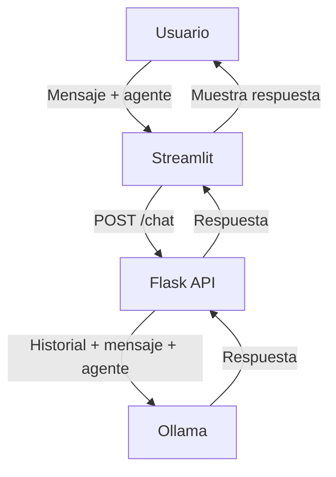

# Documentación Técnica: agent_with_memory

## Descripción General

El sistema `agent_with_memory` implementa un chat avanzado con múltiples agentes personalizados, cada uno con su propia personalidad y especialidad. Mantiene memoria de la conversación por sesión y permite cambiar de agente o crear agentes personalizados.

---

## Arquitectura

- **Backend:** Flask (`app.py`)
- **Frontend:** Streamlit (`web.py`)
- **Memoria:** Historial de conversación en memoria RAM, por sesión y por agente
- **Modelo LLM:** Ollama con `llama3.2:1b`

---

## Flujo de Datos

1. **Usuario** selecciona un agente y escribe un mensaje en la web (Streamlit)
2. **Frontend** envía el mensaje, el `session_id` y el `agent_id` al backend (`/chat`)
3. **Backend** recupera el historial de la sesión y agente, añade el mensaje, consulta a Ollama, guarda la respuesta y la devuelve
4. **Frontend** muestra la respuesta y actualiza el historial
5. El usuario puede cambiar de agente o crear uno nuevo, lo que reinicia el historial para esa sesión

---

## Backend (`app.py`)

- **Memoria:**
  - Diccionario global `conversation_history` para guardar el historial por sesión y agente
  - Diccionario `current_agents` para saber qué agente está activo por sesión
  - Función `get_or_create_conversation(session_id, agent_id)` para inicializar o recuperar la conversación
- **Agentes:**
  - Biblioteca de agentes predefinidos (TechBot, MathBot, ChefBot, FitBot, CreativeBot, BizBot)
  - Permite crear agentes personalizados con instrucciones específicas
- **Endpoints:**
  - `/agents` (GET): Lista los agentes disponibles
  - `/set_agent` (POST): Cambia el agente de la sesión
  - `/create_custom_agent` (POST): Crea un agente personalizado
  - `/chat` (POST): Recibe mensaje, actualiza historial, consulta a Ollama, responde
  - `/reset` (POST): Reinicia la conversación manteniendo el agente actual
- **Gestión de memoria:**
  - Limita el historial a los últimos 20 mensajes + mensaje de sistema

---

## Frontend (`web.py`)

- **Interfaz avanzada** con Streamlit
- **Selector de agentes** y creador de agentes personalizados
- **Genera un `session_id` único** por usuario
- **Muestra historial** y permite enviar mensajes
- **Permite reiniciar** la conversación o cambiar de agente
- **Muestra información** de la sesión y del agente

---

## Personalidad y Memoria

- Cada agente responde según su personalidad y especialidad
- El contexto se mantiene gracias al historial, permitiendo respuestas coherentes y con memoria
- Cambiar de agente reinicia el historial para esa sesión

---

## Resumen de Endpoints

- `GET /agents` — Listar agentes disponibles
- `POST /set_agent` — Cambiar agente
- `POST /create_custom_agent` — Crear agente personalizado
- `POST /chat` — Enviar mensaje y obtener respuesta
- `POST /reset` — Reiniciar conversación

---

## Ejemplo de Flujo

---

## Personalización

- Puedes crear agentes personalizados desde la interfaz o modificando el código
- Para cambiar la personalidad de un agente predefinido, edita el diccionario `AVAILABLE_AGENTS` en `app.py`

---

## Notas

- El historial se almacena solo en memoria RAM (no persistente)
- El sistema está optimizado para evitar exceso de tokens
- Ideal para soporte técnico, tutorías, cocina, fitness, creatividad y negocios
