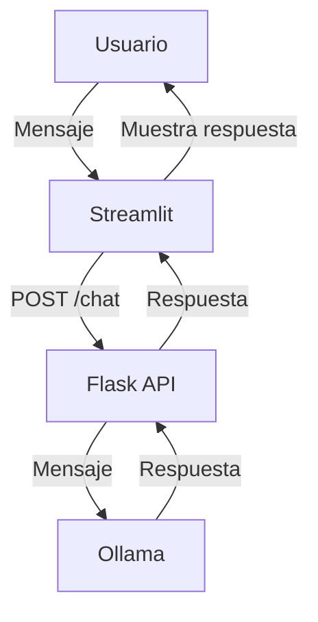

# Documentación Técnica: basic_chat

## Descripción General

El sistema `basic_chat` implementa un chatbot sencillo usando Flask como backend y Streamlit como frontend. No mantiene memoria de la conversación: cada mensaje es independiente.

---

## Arquitectura

- **Backend:** Flask (`app.py`)
- **Frontend:** Streamlit (`web.py`)
- **Modelo LLM:** Ollama con `llama3.2:1b`

---

## Flujo de Datos

1. **Usuario** escribe un mensaje en la web (Streamlit)
2. **Frontend** envía el mensaje al backend (`/chat`)
3. **Backend** consulta a Ollama con el mensaje recibido
4. **Backend** devuelve la respuesta al frontend
5. **Frontend** muestra la respuesta

---

## Backend (`app.py`)

- **Sin memoria:**
  - Cada mensaje se procesa de forma aislada
- **Endpoint:**
  - `/chat` (POST): Recibe mensaje, consulta a Ollama, responde
- **Modelo:**
  - Usa el modelo `llama3.2:1b` para generar la respuesta

---

## Frontend (`web.py`)

- **Interfaz simple** con Streamlit
- **Permite enviar mensajes** y ver la respuesta
- **No mantiene historial** de la conversación

---

## Resumen de Endpoints

- `POST /chat` — Enviar mensaje y obtener respuesta

---

## Ejemplo de Flujo

---

## Notas

- No hay memoria ni contexto entre mensajes
- Ideal para consultas rápidas e independientes
- Arquitectura minimalista y fácil de extender
