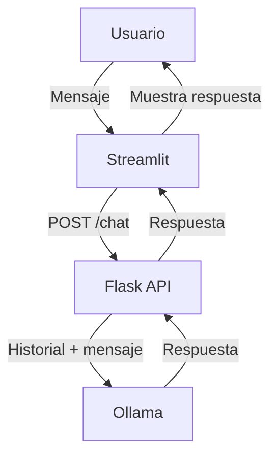

# Documentación Técnica: single_agent

## Descripción General

El sistema `single_agent` implementa un chatbot con memoria y personalidad definida, usando Flask como backend, Streamlit como frontend y Ollama (modelo llama3.2:1b) como motor LLM.

---

## Arquitectura

- **Backend:** Flask (`app.py`)
- **Frontend:** Streamlit (`web.py`)
- **Memoria:** Historial de conversación en memoria RAM, por sesión
- **Modelo LLM:** Ollama con `llama3.2:1b`

---

## Flujo de Datos

1. **Usuario** escribe un mensaje en la web (Streamlit)
2. **Frontend** envía el mensaje y `session_id` al backend (`/chat`)
3. **Backend** recupera historial, añade el mensaje, consulta a Ollama, guarda la respuesta y la devuelve
4. **Frontend** muestra la respuesta y actualiza el historial

---

## Backend (`app.py`)

- **Memoria:**
  - Diccionario global `conversation_history` para guardar el historial por sesión
  - Función `get_or_create_conversation(session_id)` para inicializar o recuperar la conversación
- **Personalidad:**
  - Mensaje de sistema `AGENT_SYSTEM_MESSAGE` define el rol y comportamiento de "TechBot"
- **Endpoints:**
  - `/chat` (POST): Recibe mensaje, actualiza historial, consulta a Ollama, responde
  - `/reset` (POST): Reinicia la conversación de la sesión
  - `/history` (GET): Devuelve el historial de la sesión
- **Gestión de memoria:**
  - Limita el historial a los últimos 20 mensajes + mensaje de sistema

---

## Frontend (`web.py`)

- **Interfaz moderna** con Streamlit
- **Genera un `session_id` único** por usuario
- **Muestra historial** y permite enviar mensajes
- **Permite reiniciar** la conversación desde la barra lateral
- **Muestra información** de la sesión y del agente

---

## Personalidad y Memoria

- El agente responde siempre como "TechBot", con tono amigable, profesional y explicaciones paso a paso
- El contexto se mantiene gracias al historial, permitiendo respuestas coherentes y con memoria

---

## Resumen de Endpoints

- `POST /chat` — Enviar mensaje y obtener respuesta
- `POST /reset` — Reiniciar conversación
- `GET /history` — Obtener historial de la sesión

---

## Ejemplo de Flujo

---

## Personalización

Para cambiar la personalidad del agente, edita la variable `AGENT_SYSTEM_MESSAGE` en `app.py`.

---

## Notas

- El historial se almacena solo en memoria RAM (no persistente)
- El sistema está optimizado para evitar exceso de tokens
- El agente es ideal para soporte técnico y programación
